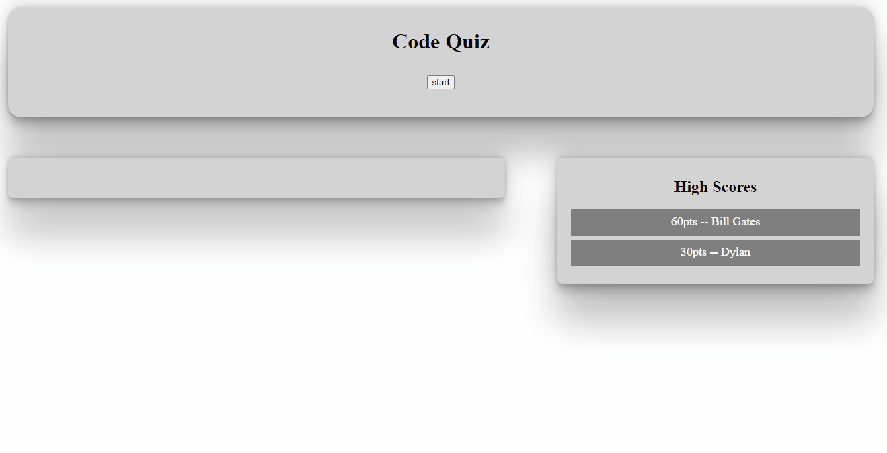

[](https://opensource.org/licenses/MIT)<br>

# Code Quizz
Realized for UC Berkeley Extension Coding Bootcamp



<br>

[Deployed Link](https://dylancouzon.github.io/Code-Quizz/)
<br>

## Table of Contents

1. [Technology](#technology)
2. [Summary](#Summary)
3. [Code Snippet](#Code)
3. [Author](#Author)
<br>
<hr>

## Technology
 &nbsp;
 &nbsp;
 &nbsp;
<br>
<hr>

## Summary 
You have 30seconds to answer 10 code related questions,
Everytime you answer correctly, you earn 10pts, everytime you answer incorrectly, the timer lose 5sec.
When the timer reaches 0, it is Game over. You then have the option to input your name into the High score board and then play again.
The High score board is using Local Storage for Data persistence.


## Code
```javascript
scoreList.addEventListener("submit", function(event) {

  event.preventDefault();
  var name = document.getElementById("name");
  stores = storedScore.push(score + "pts -- " + name.value);
  localStorage.setItem("score", JSON.stringify(storedScore));
  scoreList.innerHTML = "";
  highScore();

});
```
In the code snippet above, you can see the function that I used to store the user Score whenever they hit the submit button.
I then call the highScore function that will update the board with the new data.
<br>
<hr>

## Author
- [dylancouzon@gmail.com](mailto:dylancouzon@gmail.com)
- [GitHub](https://github.com/Dylancouzon)
- [LinkedIn](https://www.linkedin.com/in/dcouzon/)

