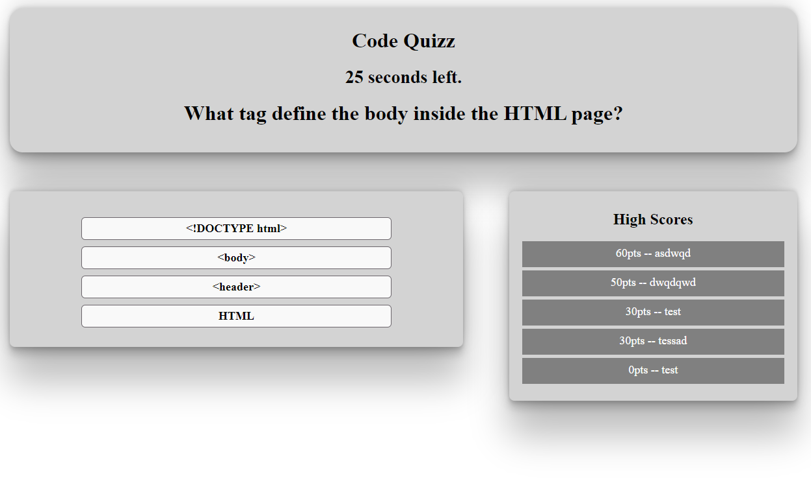

# Code-quizz
Homework due 2021-3-23

## Technologies Used
- HTML - Creates text and differents elements 
- CSS - styles html elements on page
- Javascript - Ask the questions
- Local Storage - Store the High Score
- GitHub - hosts and deploys the pages
- Bash - Terminal

## Summary 
Code quiz,
The user has 30seconds to answer 10 code related questions,
Everytime the user answer correctly, he earns 10pts, everytime they answer incorrectly, the timer lose 5sec.
When the timer reaches 0, it is Game over. The user then has the option to input his name into the High score board and then play again.

## Author Links
[LinkedIn](https://www.linkedin.com/in/dcouzon/)
[GitHub](https://github.com/Dylancouzon)

